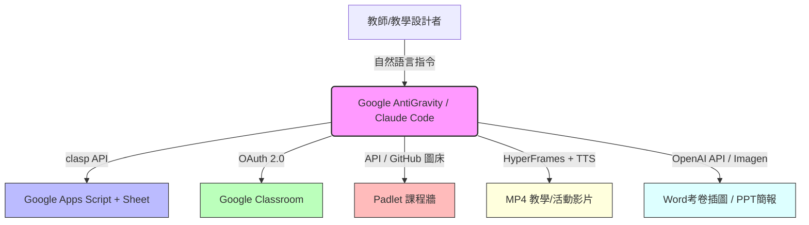

# 教育自動化與影音生成指引

本指引彙整了 9 篇關於教育教學自動化、AI Agent 應用、考卷與簡報自動生成、以及影音全自動剪輯的工作流與核心知識。透過整合各大 AI 工具與平台，旨在幫助教師、學生與家長免除繁瑣勞務，專注於核心教育設計與學習成效。

---

## 📌 目錄
1. [課程與教學文件自動化](#一課程與教學文件自動化)
   - [使用 AI Agent 幫忙寫年度課程領域計畫](#1-使用-ai-agent-幫忙寫年度課程領域計畫)
   - [AntiGravity 基本功 EP02：備課救星（出考卷、填文件、檔案歸檔）](#2-antigravity-基本功-ep02備課救星出考卷填文件下載考古題整理檔案夾)
   - [AntiGravity 基本功 EP03：最強備課懶人包（clasp 免複製部署 GAS）](#3-antigravity-基本功-ep03最強備課懶人包寫-gas-竟然再也不用複製貼上程式碼)
   - [AI 作文批改：學生和家長的自學救星](#4-ai-作文批改學生和家長的自學救星教學應用)
2. [AI 生圖技術與教學深度整合](#二ai-生圖技術與教學深度整合)
   - [Claude 基本功 EP11：將 GPT-Image 2.0 裝進 Claude](#5-claude基本功ep11把-gpt-image-20-裝進-claude讓-claude-擁有最強生圖引擎)
   - [Claude 基本功 EP12：Claude + Image 2 的三大神級教學應用](#6-claude基本功ep12必看快速掌握-claude--image-2-的三大神級教學應用)
3. [雲端課堂平台接管與社群互動](#三雲端課堂平台接管與社群互動)
   - [Antigravity 基本功 EP06：全面代理你的 Google Classroom](#7-antigravity-基本功-ep06全面代理你的-google-classroom派作業收作業批改一次搞定)
   - [AntiGravity 基本功 EP07：一句話生成 Padlet 課程牆](#8-antigravity-基本功-ep07一句話生成-padlet-課程牆分區投票ai-插圖全自動完成)
4. [自動化影音生成與實測](#四自動化影音生成與實測)
   - [用 4 大 AI Agent 全自動產出 3 種實用影片](#9-懶人包大放送用-4-大-ai-agent-全自動產出-3-種實用影片hyperframes-懶人包福利大放送)

---

## 一、課程與教學文件自動化

### 1. 使用 AI Agent 幫忙寫年度課程領域計畫
* **原字幕檔連結**：[[notes/Clipping/使用 AI Agent 來幫忙寫年度課程領域計畫_claude code_codex_領域課程計畫還在自己手寫？看我如何用 AI 一鍵搞定這項大工程！.md|原字幕檔]]
* **影片連結**：[YouTube 影片](https://www.youtube.com/watch?v=EnX8PGP1lNM)

> [!NOTE]
> **一句話精華**：利用 AI Agent 自動讀取並對齊教材版本（如翰林數學）與學校指定的年度課程計畫範本，實現一鍵自動化撰寫與另存新檔。

#### 💡 三大核心知識點
1. **集中檔案與授權**：建立獨立專案資料夾，將學校計畫範本（分上下學期）與出版社教材大綱放置其中，並在 AI Agent (如 Claude) 開啟對話時授權信任該資料夾。
2. **精準對齊填寫**：以清晰的自然語言指令，指示 AI 讀取檔案，將出版社的單元內容、學習目標與節數，自動對應並填入學校範本的指定表格欄位中。
3. **自然語言動態微調**：填寫完成後，免去手動開檔修改，直接在對話中以自然語言要求 AI 進行內容調整或微調，AI 將自動更新並提交檔案。

* **涉及的 AI 軟體 / 工作流工具**：AI Agent (Claude Code / Codex)、Excel / Word 課程計畫範本。

---

### 2. AntiGravity 基本功 EP02：備課救星（出考卷、填文件、下載考古題、整理檔案夾）
* **原字幕檔連結**：[[notes/Clipping/AntiGravity基本功EP02_備課救星_極速處理教學檔案_出考卷_填文件_下載考古題_整理檔案夾.md|原字幕檔]]
* **影片連結**：[YouTube 影片](https://www.youtube.com/watch?v=U4C0dGbQtQA)

> [!NOTE]
> **一句話精華**：本集展示 Google AntiGravity 如何透過 Python 自動繪圖與 OMML 數學格式一鍵出 Word 考卷、自動提取 Obsidian 個人資料填寫講師簡歷，以及全自動安全整理下載資料夾。

#### 💡 三大核心知識點
1. **OMML 格式與數學公式排版**：使用 Python 生產 Word 檔時，利用 `python-docx` 配合 **OMML (Office Math Markup Language)** 格式，可讓 AI 完美排出符合數學考卷標準的分數、根號、絕對值及不等式符號，免去手動輸入公式編輯器的痛苦。
2. **Python 動態繪圖與 Word 插入**：AI 能根據數學題目需求，利用 Python (如 `matplotlib`) 在本地端即時繪製幾何圖形或函數座標圖，儲存至 `images/` 資料夾後自動塞入產出的 Word 考卷中。
3. **個人資料庫連結與資料夾安全整理**：AI 可讀取使用者的第二大腦 (Obsidian 筆記) 來自動填寫講師簡歷等表格；整理混亂的下載資料夾時，AI 會先分析檔案並建立「待刪除」與歸檔分類計畫，經人工確認後才執行，保障資料安全。

* **涉及的 AI 軟體 / 工作流工具**：Google AntiGravity、Python (`matplotlib`, `python-docx`)、OMML 格式、Obsidian 第二大腦。

---

### 3. AntiGravity 基本功 EP03：最強備課懶人包（clasp 免複製部署 GAS）
* **原字幕檔連結**：[[notes/Clipping/AntiGravity基本功EP03_最強備課懶人包_寫 GAS 竟然再也不用複製貼上程式碼？我是怎麼做到的.md|原字幕檔]]
* **影片連結**：[YouTube 影片](https://www.youtube.com/watch?v=-oBHrpEsJs8)

> [!NOTE]
> **一句話精華**：介紹如何開啟 AntiGravity 的 Turbo Mode，並整合 Netlify 與 Google Apps Script (clasp API)，以自然語言開發出免手動複製貼上程式碼的 Google 試算表輕量型資料庫系統。

#### 💡 三大核心知識點
1. **Turbo Mode 與安全設定優化**：在專案設定中啟用 Turbo Mode 並將 Behaviour 設為 Always Proceed，可以關閉重複的權限核准彈窗，大幅加快 AI Agent 在本地編譯與執行命令的流暢度。
2. **Netlify 與 GAS (clasp) 的輕量級替代方案**：使用 Netlify 部署前端網頁，並使用 Google Apps Script (GAS) 控制 Google 試算表作為資料庫，避開了 Firebase 與 GitHub 的高學習門檻，非常適合班級成績登錄、問卷或飲料訂單等中低頻讀寫情境（高頻或多人即時讀寫仍建議使用 Firebase）。
3. **clasp 實現「零複製貼上」自動部署**：在 Google Apps Script 使用者設定中開啟 API 權限，AI 即可在本地透過 `clasp` (Command Line Apps Script Projects) 工具直接將寫好的 JavaScript 程式推送並覆寫至雲端 GAS 專案。

* **涉及的 AI 軟體 / 工作流工具**：Google AntiGravity (Turbo Mode)、Netlify、clasp (GAS 命令行工具)、Google Apps Script (GAS)、Google 試算表。

---

### 4. AI 作文批改：學生和家長的自學救星教學應用
* **原字幕檔連結**：[[notes/Clipping/AI 作文批改_學生和家長的自學救星_教學應用_教育_國中國中_教育會考_claude.ai.md|原字幕檔]]
* **影片連結**：[YouTube 影片](https://www.youtube.com/watch?v=XRxJLfFwzOM)

> [!NOTE]
> **一句話精華**：利用行動裝置內建的相機文字擷取技術，配合 Claude.ai 依據國中教育會考評分標準，為學生搭建包含原文對稱改寫與修正建議的表格化「寫作學習鷹架」。

#### 💡 三大核心知識點
1. **直式手寫文字辨識與校對**：面對會考的直式寫作限制，學生可手寫練習後，使用 iOS 內建相機的「文字擷取 (Live Text)」功能拍照拷貝，貼入 Google 文件中進行快速校對（辨識率約 80%-90%），保留原文的錯別字讓 AI 批改。
2. **標準化評分指引導入**：在批改前，先將官方的會考作文評分標準（立意取材、組織結構、遣詞造句、錯別字）餵給 Claude，使其理解台灣會考的具體要求，隨後再給出學生作文，Claude 即可給出極具信度的級分評估與客觀評語。
3. **三欄式改寫鷹架表格**：透過 Prompt 要求 Claude 輸出三欄表格（第一欄：原文段落；第二欄：修正建議；第三欄：升級後的六級分改寫段落）。此方法在維持學生原意的前提下進行語句修飾，極利於學生模仿學習。

* **涉及的 AI 軟體 / 工作流工具**：Claude.ai (免費/付費版)、iOS Live Text、Google 試算表 / 文件。

---

## 二、AI 生圖技術與教學深度整合

### 5. Claude基本功EP11：把 GPT-Image 2.0 裝進 Claude（讓 Claude 擁有最強生圖引擎）
* **原字幕檔連結**：[[notes/Clipping/claude基本功EP11_把 GPT-Image 2.0 裝進 Claude_讓 Claude 擁有最強生圖引擎.md|原字幕檔]]
* **影片連結**：[YouTube 影片](https://www.youtube.com/watch?v=JqoZH5__gsk)

> [!NOTE]
> **一句話精華**：教學如何以 OpenAI API Key 代替每月 20 美元的 ChatGPT 訂閱，在 Claude Code 中整合 GPT-Image 2.0 (DALL-E 3) 生圖引擎，實現低成本、高效率的自動化生圖。

#### 💡 三大核心知識點
1. **極低成本的 API 生圖方案**：相較於每月 20 美金的 ChatGPT 訂閱，使用 OpenAI API Key 呼叫生圖。預設最低畫質 (low) 生成一張 1024x1024 圖片僅需約台幣 0.3 元（約 0.01 美元），儲值 20 美元即可生成高達 2000 張。
2. **API 帳號儲值安全防護**：在 OpenAI 平台綁定信用卡儲值時，強烈建議關閉「自動儲值 (Auto Recharge)」功能，避免 API Key 意外洩漏時被無限制刷爆，並需完成個人用戶身分驗驗。
3. **Claude Code 整合 Draw 技能**：透過下載特定 `Draw` 技能的 md 檔，Claude 可在其工作流中偵測並呼叫該指令，生圖後會直接存入本地專案資料夾中，生圖不再是終點，而是其他自動化技能的燃料。

* **涉及的 AI 軟體 / 工作流工具**：Claude Code、OpenAI API Key (DALL-E 3 / Imagen 2.0)、Obsidian。

---

### 6. Claude基本功EP12：必看！快速掌握 Claude + Image 2 的三大神級教學應用
* **原字幕檔連結**：[[notes/Clipping/Claude基本功EP12_必看！快速掌握 Claude + Image 2 的三大神級教學應用.md|原字幕檔]]
* **影片連結**：[YouTube 影片](https://www.youtube.com/watch?v=dPA_S5PD7lU)

> [!NOTE]
> **一句話精華**：展示 Claude 串接 Image 2 後，在 Word 考卷插圖、製作三種版本的可編輯 PPT 投影片，以及結合 HTML 與 Edge TTS 打造具備圖像形象的語音教學助教之實戰應用。

#### 💡 三大核心知識點
1. **考卷情境插圖一條龍**：AI 能在出數學生活應用題或幾何題時，自動呼叫 API 繪製相應情境的插圖（如跑步路線示意圖、幾何全等形狀），並完美將圖片與文字整合進 Word 考卷中。
2. **簡報生成的三種版本演進**：
     - *第一版（基本款）*：原生 PPTX 格式，內文可改，由 AI 插入普通配圖。
     - *第二版（NotebookLM 風格）*：每頁簡報均為整張 AI 生成的統一風格底圖，視覺一致性最高，但文字為圖片一部份無法修改。
     - *第三版（究極圖文分離）*：AI 生成無文字的精美底圖，再以程式疊加可編輯的 PowerPoint 文字框，兼顧視覺質感與內容修改彈性。
3. **動態教學遊戲與互動助教**：利用 HTML、Claude Design、Edge TTS 與生圖技術，可一條龍自動產出華麗的教學網頁遊戲素材；更能為 Claude 建立如黑貓「小克」的具體形象與個性，讓助教在課堂上自主播放簡報並以語音引導授課。

* **涉及的 AI 軟體 / 工作流工具**：Claude Code/Claude.ai、GPT-Image 2.0 (Imagen 2)、python-pptx / python-docx、HTML/CSS、Edge TTS。

---

## 三、雲端課堂平台接管與社群互動

### 7. Antigravity 基本功 EP06：全面代理你的 Google Classroom（派作業、收作業、批改一次搞定）
* **原字幕檔連結**：[[notes/Clipping/Antigravity 基本功 EP06_全面代理你的 Google Classroom_派作業、收作業、批改一次搞定：AI × Google Classroom 完整教學.md|原字幕檔]]
* **影片連結**：[YouTube 影片](https://www.youtube.com/watch?v=vYb87aqvBuE)

> [!NOTE]
> **一句話精華**：引導如何使用個人版 Google AntiGravity 透過 Google Cloud Platform 的 API 設定與 OAuth 2.0 授權，全面接管並代理教育帳號下的 Google Classroom 課程。

#### 💡 三大核心知識點
1. **個人版 AI 代理教育版 Classroom**：由於學校教育網域通常限制直接安裝未經審核的 AI 工具，教師可使用個人版 Google 帳號的 AntiGravity 作為開發者，透過 GCP 授權與認證，間接遙控教育帳號的課堂。
2. **GCP 憑證與 OAuth 2.0 設定**：在 Google Cloud Console 中建立專案、啟用 Google Classroom API，於「OAuth 同意畫面」加入測試郵件，並分別下載電腦版憑證 (`credentials.json`) 與設定網頁版憑證 ID，完成對話環境與本地端的信任登錄。
3. **自動化指派與班級名單串接**：連線後，AI 可用語音或文字直接發布帶有教材附件與說明影片的複雜課堂作業；更可將 Classroom 的學生名單自動串接到教師自製的點名或抽籤網頁中，免去二次輸入名冊。

* **涉及的 AI 軟體 / 工作流工具**：Google AntiGravity、Google Cloud Console、Google Classroom API、OAuth 2.0 憑證、Netlify。

---

### 8. AntiGravity 基本功 EP07：一句話生成 Padlet 課程牆（分區、投票、AI 插圖全自動完成）
* **原字幕檔連結**：[[notes/Clipping/AntiGravity 基本功 EP07_一句話生成 Padlet 課程牆_分區、投票、AI 插圖全自動完成.md|原字幕檔]]
* **影片連結**：[YouTube 影片](https://www.youtube.com/watch?v=wrSYyOxf7n4)

> [!NOTE]
> **一句話精華**：介紹作者開源的 Padlet MCP 全功能工具，如何協助 AI Agent 一句話建立有投票與分區功能的 Padlet 課程牆，並以 GitHub 作為圖床自動置入 AI 插圖及自動批改回覆留言。

#### 💡 三大核心知識點
1. **全功能自主開發 Padlet MCP**：為解決官方 MCP 功能簡陋的問題，作者重新編寫了 Padlet MCP，允許 AI Agent 在擁有 API 金鑰的付費/教育版帳戶上執行：一鍵建板、新增區段、嵌入卡片、留言與獲取即時投票結果。
2. **GitHub 圖床自動串接**：由於 Padlet API 限制無法直接從本地上傳檔案，AI Agent 會採用折衷方案：自動將生成的插圖推送至教師的 GitHub 倉庫，再將該網路圖片網址嵌入至 Padlet 卡片中，實現全自動圖片展示。
3. **課堂互動回饋與板面重構**：AI 可以讀取牆面上學生的手寫計算照片附件並下載批改，自動留言給予客觀回饋。由於官方 API 不支援動態修改區段與刪除，AI 可採取「讀取舊板內容並重新生成分類清晰的新板」來實現板面整理。

* **涉及的 AI 軟體 / 工作流工具**：開源 Padlet MCP、GitHub 倉庫（作圖床）、Google AntiGravity、OpenAI API / Imagen。

---

## 四、自動化影音生成與實測

### 9. 懶人包大放送！用 4 大 AI Agent 全自動產出 3 種實用影片（Hyperframes 懶人包福利大放送）
* **原字幕檔連結**：[[notes/Clipping/懶人包大放送！用 4 大 AI Agent 全自動產出 3 種實用影片_Hyperframes 懶人包福利大放送 三大類型影片包_.md|原字幕檔]]
* **影片連結**：[YouTube 影片](https://www.youtube.com/watch?v=2B3U9bq2lsg)

> [!NOTE]
> **一句話精華**：實測四大 AI Agent（Claude Code, Codex, AntiGravity 2.0, OpenCode）結合 HyperFrames 影片生成與 Edge TTS 語音工具，自動產出活動紀錄、教學與科普三類影片的效率及 Token 成本對比。

#### 💡 三大核心知識點
1. **零剪輯軟體開檔的影音流水線**：AI Agent 呼叫 **HyperFrames** 與 **Edge TTS** 工具，在本地端自動讀取素材、撰寫口白、生成字幕與語音，並剪輯與淡入配樂，直接渲染輸出為 MP4 影片，全程無須人工剪輯。
2. **三大實用影片類型規範**：
     - **活動紀錄**：依編號排序的照片（每張約 5 秒），搭配適當轉場與活動大字卡。
     - **教學影片**：提供核心概念（如數學因數倍數），由 AI 撰寫口白與教學字卡，搭配 TTS 語音朗讀。
     - **科普影片**：解說抽象概念（如 AI 上下文機制的 Token 與 RAG），需要有吸引人的 Hook 與生活化比喻。
3. **四大 AI Agent 實測特點與算力配置心法**：
     - **Google AntiGravity (Gemini 3.5 Flash)**：生成速度極快，性價比高，在此類影音生產任務中表現最為亮眼。
     - **OpenCode (DeepSeek V4 Flash)**：Token 成本近乎免費且穩定，極適合套用固定工作流跑「影音粗活（做苦工）」。
     - **Claude Code (Sonnet 4.6)**：綜合能力強但費用極高，不建議用於低思考、高產出的影音粗活任務。
     - **Codex (GPT-4 / 5.4 mini)**：小模型在理解複雜工作流時表現較差，易翻車，建議升級至 GPT-5.5 等級。

* **涉及的 AI 軟體 / 工作流工具**：HyperFrames 影片生成工具、Edge TTS、Suno (音樂生成)、四大 AI Agent (AntiGravity, OpenCode, Claude Code, Codex)。

---

## 🛠️ 教育自動化工具整合關係圖

## 📊 AI Agent 影音與文件生產任務配置建議

| 任務類型 | 推薦模型/工具 | Token 消耗與性價比 | 實作重點與技巧 |
| :--- | :--- | :--- | :--- |
| **影音生成與改檔 (粗工/苦工)** | OpenCode (DeepSeek V4 Flash) / AntiGravity (3.5 Flash) | ⚠️ 極低 / 低 (幾乎免費 / 划算) | 預先編寫好工作流 (Workflow) 或 Repo 規範，讓便宜模型照表操課，避免浪費高級算力。 |
| **數學考卷與幾何圖形生成** | AntiGravity (Gemini 3.5 Flash) + python-docx | 💵 中等 | 必須明確要求數學公式使用 **OMML** 格式，幾何圖形利用 Python 繪製後再插入。 |
| **互動網頁遊戲與精美 PPTX** | Claude Code (Sonnet 4.6 / Opus) + Imagen 2 | 💰 高 (消耗快) | 使用「圖文分離底圖」方案，讓投影片維持高質感且文字可編輯；可利用 HTML 與 TTS 塑造動態助教形象。 |
| **大規模 Classroom / Padlet 接管** | 專用 MCP / OAuth 憑證 + AntiGravity | 💵 中等 | 首次設定 OAuth 憑證及金鑰較複雜，設定成功後即可利用自然語言全面遙控勞務。 |

---

> [!TIP]
> **總結建議**：在 AI Agent 時代下，教師不應僅依賴單一模型，應根據任務難易度進行分工：**「用最聰明的模型（如 Claude Sonnet/Opus）來做教學設計與規劃，用最便宜的模型（如 DeepSeek Flash）來執行影片剪輯、檔案分類等粗活。」** 如此才能將 AI 的效能與算力成本優化至極致。
